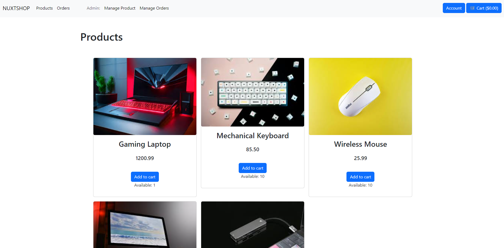
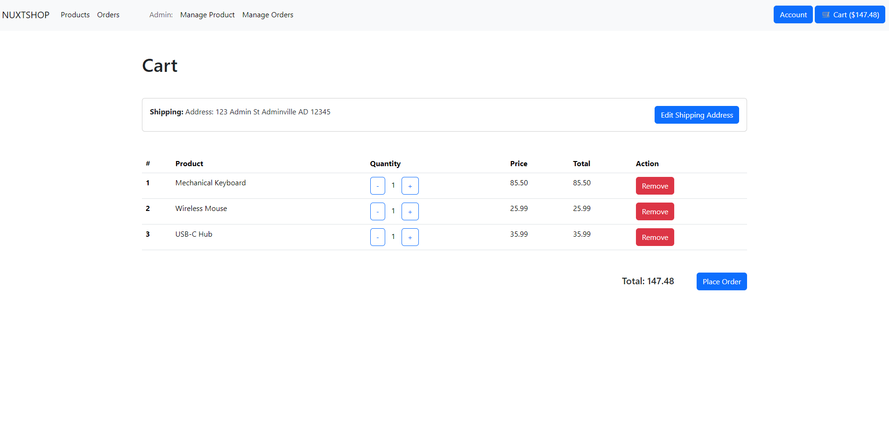
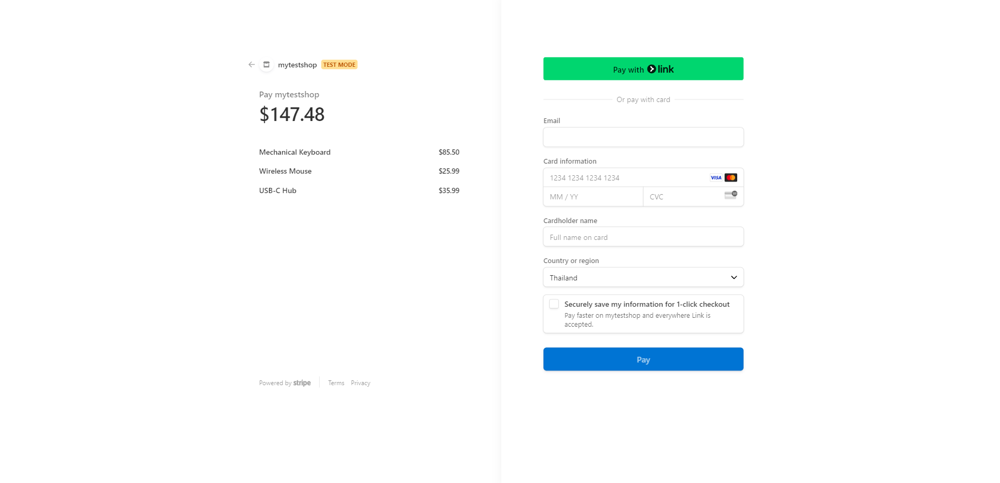
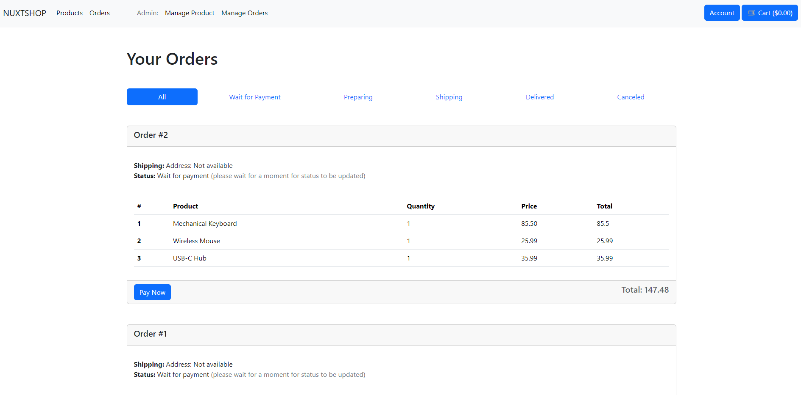
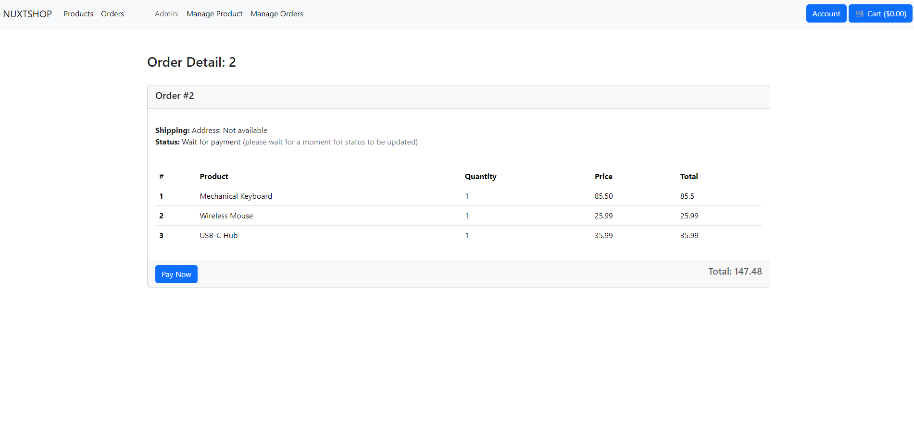
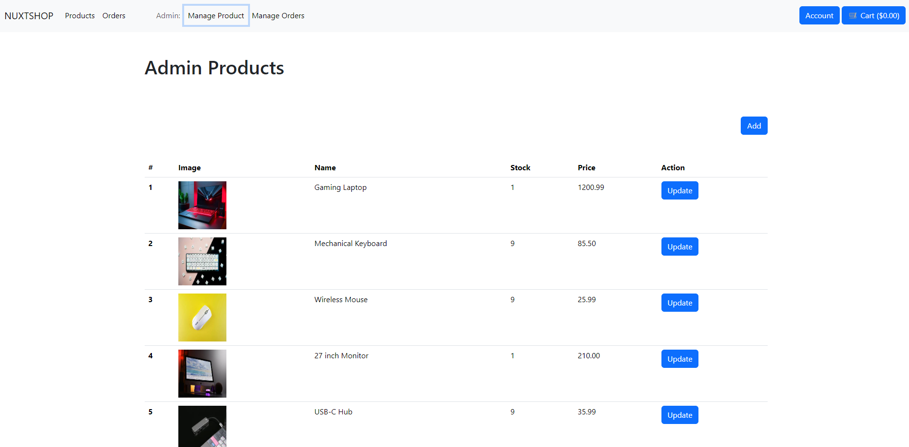
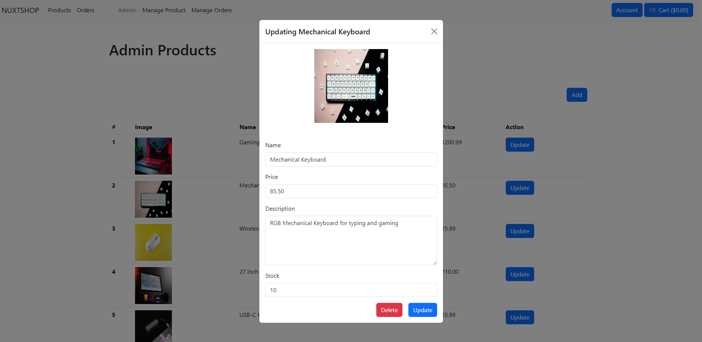
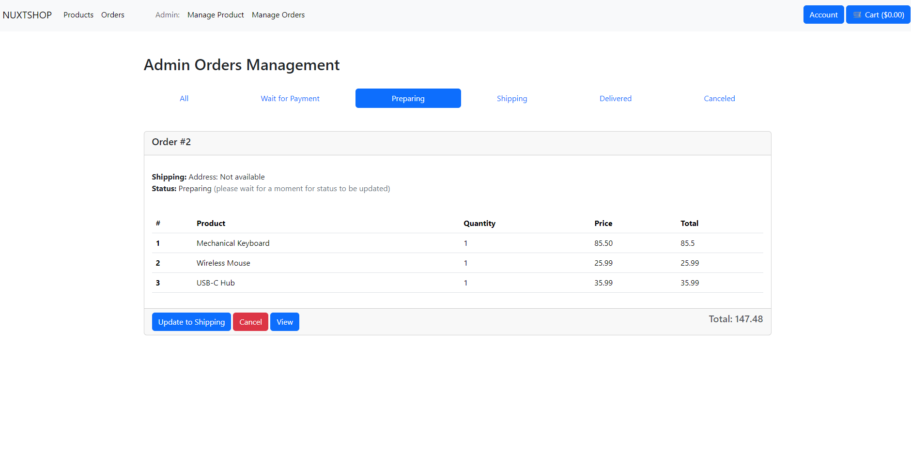

# Nuxtshop

I'm experimenting with Nuxt 3 to build a shopping site. Some features are unstable but worth trying.


# Screenshots


 











## Setup

Make sure to install the dependencies:

```bash
yarn install
```

## Development

Start the development server on `http://localhost:3000`:

```bash
yarn dev
```

## Production

Build the application for production:

```bash
docker compose up -d
```

Check out the [deployment documentation](https://nuxt.com/docs/getting-started/deployment) for more information.
